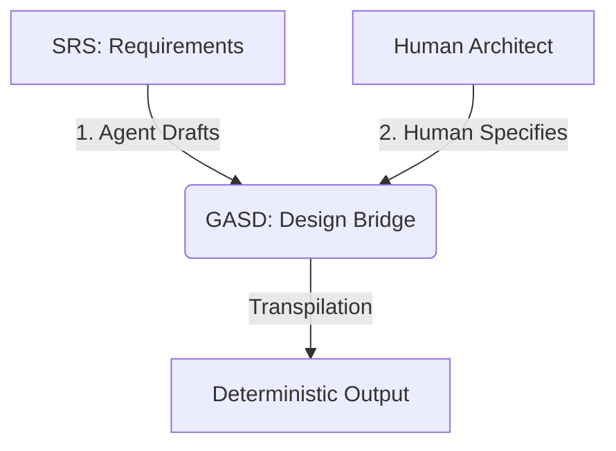

# GASD 1.0.0 — Official Authoritative General Agentic Software Design Language

GASD is a **Design Bridge Language** that connects upstream Requirements (SRS) to downstream Implementation (Code).

## Core Concept: The Deterministic Bridge

GASD does not contain requirements, and it does not contain implementation code. It captures **Design Decisions** and **Implementation Constraints** so that an AI agent produces **identical code every time**.

### Integration with Agile
For GASD to coexist with user-story driven development (Agile), it must not replace user stories — it must sit downstream of them. With GASD, you insert a deterministic design bridge:

`Epic` → `User Stories` → `Acceptance Criteria` → `SRS` (optional formalization layer) → `GASD` (deterministic architecture spec) → `Transpiled Code`

It supports two collaboration paths:
1.  **Agent-First**: Agent drafts GASD from an SRS → Human reviews/modifies.
2.  **Human-First**: Human specifies the design in GASD → Agent implements the code.

Standard natural language allows for "Agent Drift" — where the AI makes different implementation choices each time. GASD eliminates this through a strict constraint system, providing an unambiguous bridge for AI-human collaboration.

- **Lock down Architecture**: Use `DECISION` blocks to choose libraries, strategies, and patterns.
- **Lock down Data**: Use `TYPE` contracts with `@annotations` for validation and formatting.
- **Lock down Logic**: Use `FLOW` and `STRATEGY` with `@error_strategy` to define the steps and algorithms without writing raw code.
- **Strict Compliance**: Fully RFC 2119 compliant (MUST, SHALL, SHOULD) for both human specifications and AI interpretations.

## Documentation

- **[Specification](GASD_Specification.md)**: The official normative reference with strict grammar and compliance rules.
- **[Self-Definition](gasd-1.0.0.gasd)**: The official AI-readable ground truth and metamodel of the language.
- **[Tutorial](GASD_Tutorial.md)**: A comprehensive guide for engineers to master GASD.
- **[Examples](examples/GASD_Examples.md)**: Real-world design patterns and algorithmic strategies.
- **[Design Principles](Design_Principles.md)**: The underlying philosophy of the Design Bridge.

## Getting Started

1. **Draft**: Provide your User Stories or SRS (Software Requirements Specification) to an AI agent to generate an initial GASD design.
2. **Review & Refine**: Humans review the GASD file for architectural correctness, security, and specific constraints.
3. **Generate**: Provide the finalized GASD to the agent with a `TARGET` (e.g., Python, Rust) to get production-ready, consistent code.

---
